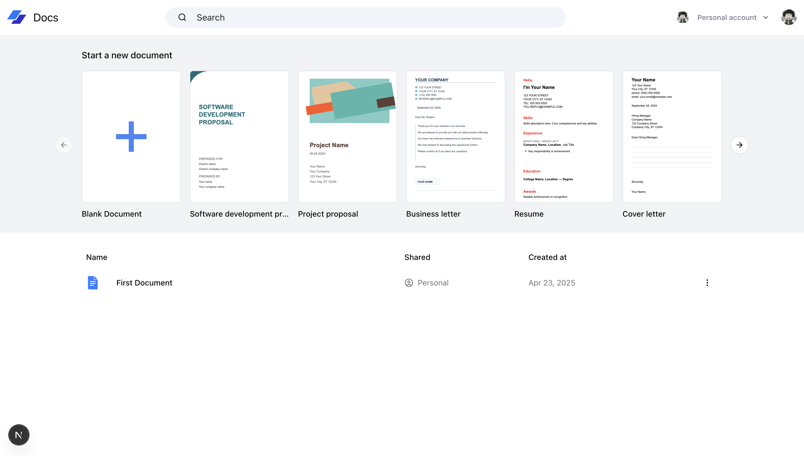
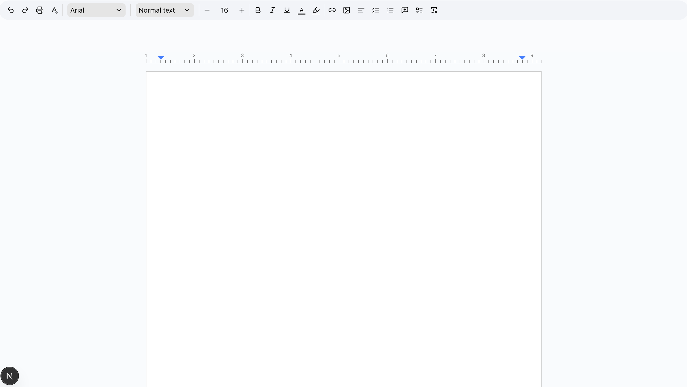

<h1 align="center" id="title">Live Collaboration Docs</h1>

<p align="center"></p>

<p id="description">A Google Docs clone is a simplified web-based word-processing application that mimics the core functionalities of Google Docs. It allows users to create edit and collaborate on documents in real time.</p>

<h2>Project Screenshots:</h2>





  
  
<h2>🧐 Features</h2>

Here're some of the project's best features:

*   <b>Real-Time Collaboration</b> – Multiple users can edit the same document simultaneously with live updates.
*   <b>Rich Text Editing</b> – Supports formatting options like bold italics headings lists and more.
*   <b>Cloud Storage</b> – Documents are saved automatically and stored online.
*   <b>>User Authentication</b> – Secure login/signup to manage documents per user.
*  <b>Version History</b> – Tracks changes and allows reverting to previous versions.
*   <b>Shareable Links</b> – Users can share documents with others via links.
*   <b>Comment System</b> – Users can comment on the docs

<h2>🛠️ Installation Steps:</h2>

<p>1. Clone repo</p>

```
git clone https://github.com/bibekdev/live-collaboration-docs.git
```

<p>2. Install dependencies</p>

```
bun install
```

<p>3. Run locally</p>

```
bun run dev
```

  
  
<h2>💻 Built with</h2>

Technologies used in the project:

*   Nextjs
*   Convex
*   Clerk
*   Tailwind
*   Shadcn/ui
